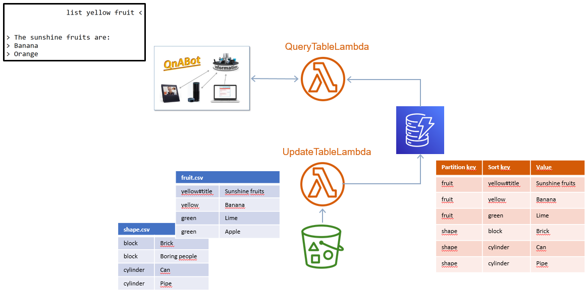
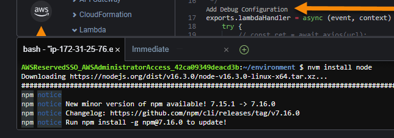

#QnA Query table

Upload lists to a bucket that can be queried from the QnA-bot.

# Install QnA Query Table in Cloud9

* Log into your AWS console with the QnA-bot account
* Make sure you are in the same region as the QnA bot
* Open Cloud9
* Create environment
* Step1: QnA query table. Environment for deploying QnA query table.
* Step2: Accept all defaults
* Step3: Create
* Install node.js in the Cloud9 shell:
  > nvm install node
>

* Install Maven
  > cd \
  > wget https://ftp.acc.umu.se/mirror/apache.org/maven/maven-3/3.8.1/binaries/apache-maven-3.8.1-bin.tar.gz \
  > tar xvf apache-maven-3.8.1-bin.tar.gz \
  > export PATH=/home/ec2-user/apache-maven-3.8.1/bin:$PATH

* Clone the Query table git:
  > cd ~/environment \
  > git clone https://github.com/andreas-jonasson/qna-querytable.git \
  > cd qna-querytable

* Install AWS CDK:
  > npm install -g aws-cdk --force

* Install the required AWS CDK packages:
  > npx npm-check-updates -u \
  > npm install

* Bootstrap AWS CDK:
  > npx cdk bootstrap

* Deploy the Query table:
  > npx cdk deploy

* Note the ARN of the query table lambda function:
  > QnaQuerytableStack.qnatablequerylambdaoutput = Your-ARN

Done!

## Usage

Create a csv-file that contain the list you would like to query. The syntax is
as follows:

question_id#title;Title for this category of items.

or

question_id;Item1

You can specify many categories in one file or split them into many files.

Example: fruits.csv

> list_yellow_fruits#title;These are the sunshine fruits: \
list_yellow_fruits;Lemon \
list_yellow_fruits;Banana \
list_yellow_fruits;Peach \
list_green_fruits#title;The good green fruits are: \
list_green_fruits;Apple \
list_green_fruits;Grape 

## Copy the csv-file to the qna-list-bucket
Use the console or aws cli. Something like this:

> aws cp fruits.csv s3://qna-list-bucket/fruits.csv --profile QnA-Admin

## In QnA-bot Designer
* Create questions with the same question_id as the csv-file
* Add a default answer in case the lambda fails
* Add the ARN for the QNA-query-table-lambda

## In the QnA-bot client
Write a matching question and get the list. Example:

User:
> list the sunshine fruits

Chatbot:
> ### These are the sunshine fruits:
>Lemon\
Banana\
Peach
