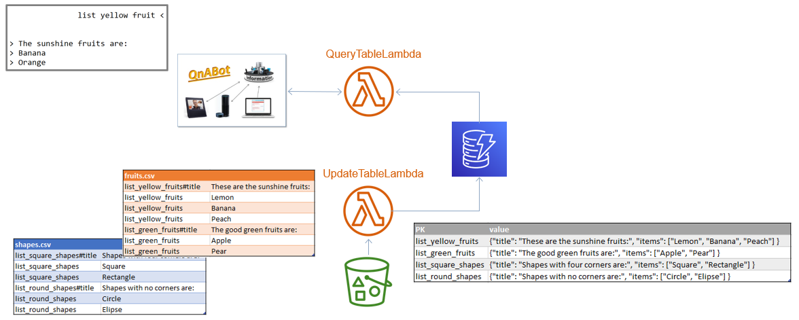

#QnA Query table

Upload lists to a bucket that can be queried from the QnA-bot.

## Usage

Create a csv-file that contain the list you would like to query. The syntax is
as follows:

question_id#title;Title for this category of items.

or

question_id;Item1

You can specify many categories in one file or split them into many files.

Example: fruits.csv

> list_yellow_fruits#title;These are the sunshine fruits: \
list_yellow_fruits;Lemon \
list_yellow_fruits;Banana \
list_yellow_fruits;Peach \
list_green_fruits#title;The good green fruits are: \
list_green_fruits;Apple \
list_green_fruits;Grape 

## In QnA-bot Designer
* Create questions with the same question_id as the csv-file
* Add a default answer in case the lambda fails
* Add the ARN for the QNA-query-table-lambda

## In the QnA-bot client
Write a matching question and get the list. Example:

User:
> list the sunshine fruits

Chatbot:
> ### These are the sunshine fruits:
>Lemon\
Banana\
Peach

# Quick installation
Edit the cloud formation template to point out the qna-querytable.jar and run it from cloud formation. 

# Advanced installation
* Install AWS CLI
* Install AWS CDK
* clone repository
* npn cdk deploy --profile QnA-Admin

# Welcome to your CDK Java project!

The `cdk.json` file tells the CDK Toolkit how to execute your app.

It is a [Maven](https://maven.apache.org/) based project, so you can open this project with any Maven compatible Java IDE to build and run tests.

## Useful commands

 * `mvn package`     compile and run tests
 * `cdk ls`          list all stacks in the app
 * `cdk synth`       emits the synthesized CloudFormation template
 * `cdk deploy`      deploy this stack to your default AWS account/region
 * `cdk diff`        compare deployed stack with current state
 * `cdk docs`        open CDK documentation

Enjoy!
